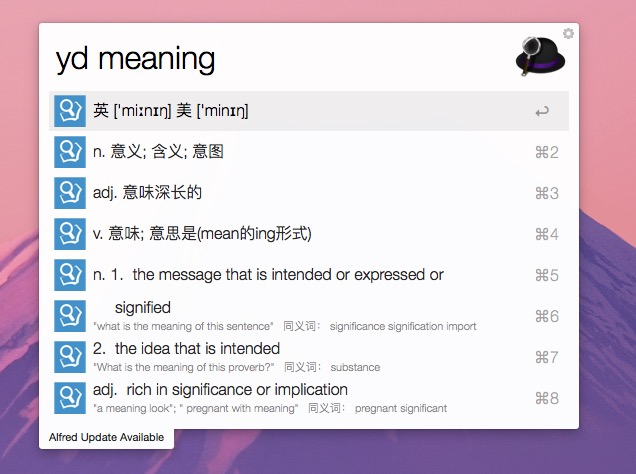

# 为什么要做这个workflow
网上现有的有道词典workflow数据来源都是有道的词典api，但是这个api里只有简单的中文翻译，而我认为学习英语一定要看单词的英语释义，所以做了这个workflow。

本工具的数据抓取自有道词典在线查词的页面，包含音标、中文释义和英英释义。有的解释文字较长，alfred会缩略显示，所以做了折行处理。不过缺点是不太美观。

# 用法
如上图所示，`yd word`即可查词。`ydc`清除缓存  
选中音标行回车可发音，默认美音，`cmd+enter`发英音。原本希望发音后仍能保留查词结果列表，但是由于alfred的机制限制，暂时无法做到。如有朋友知道在保留结果列表的基础上调用脚本，请不吝告知！

# 用到的库
[Alfred-workflow](https://github.com/deanishe/alfred-workflow/) python开发workflow的辅助库，极力推荐  
[BeautifulSoup4](https://www.crummy.com/software/BeautifulSoup/) 用优雅地方式读取网页中的数据，告别大量的正则匹配

以上库文件已包含在项目中，无需单独安装